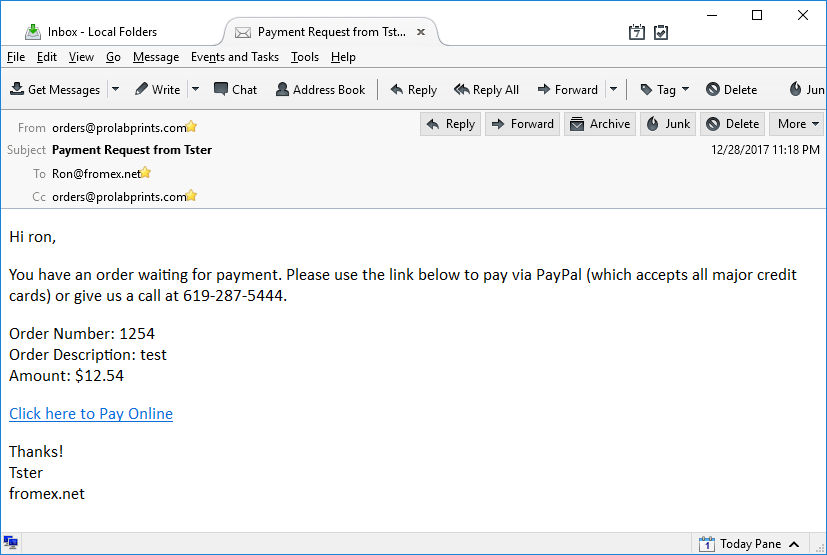

# PayPalPaymentRequester
Simple windows forms app to send a link to someone requesting they click a link to pay on your website. You would then have the PayPal Payment Form on that page.

This is built using the community version of Visual Studio.

PayPal Payment Form:  
https://rdyar.github.io/PayPalPaymentForm/?amount=123.45&orderid=4321  
PayPal Payment Form Repo:  
https://github.com/rdyar/PayPalPaymentForm

PayPal Payment Requester can integrate with LabWorks POS to pull in the name, email and amount when you enter in an order number.

To install, click the Release link above and download the current version. Unzip it and double click the `setup.exe` file.

Go to File >> Settings to configure your info.

Type in a LW Order Number and press return and it should populate the boxes below and then highlite the Custom Message text box. Click the send button and it will send the email.

The Customer First Name field can be problematic, there is no first name field in LW, just the account name. The code is checking to see if there is a comma in the account name (like `smith, dave`) and if there is then it splits it and uses the second part as the First Name. If there is no comma in the account name then it uses the whole account name.

Email is best done via AWS SES and a properly secured IAM user that only has send mail permissions. You can use Gmail or another email provider though, just know that the password is not properly secured (it is stored in plain text in some hidden file somewhere).

*Disclaimer: I have no idea what I am doing, use at your own risk.*

  

  

  

